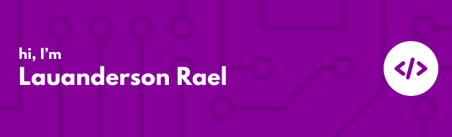

 

🚀 Passionate about challenges and technology, I'm a junior web developer with expertise in HTML, CSS, and JavaScript, taking my first steps into the world of React. Currently enrolled in the 2nd semester of Analysis and Systems Development. I love exploring new technologies and using them to create innovative, high-quality solutions.
.
&nbsp;

<!--  -->

 

 

## My Skills

#### Main Stack:

&nbsp;
&nbsp;
&nbsp;
&nbsp;
&nbsp;
&nbsp;

#### Studying in this moment:

&nbsp;

<!-- #### Databases:

&nbsp;
&nbsp; -->

#### Workstation Tools:

&nbsp;

&nbsp;
&nbsp;

## Contacts:

 
    
    
     
     

&nbsp;&nbsp;

 

